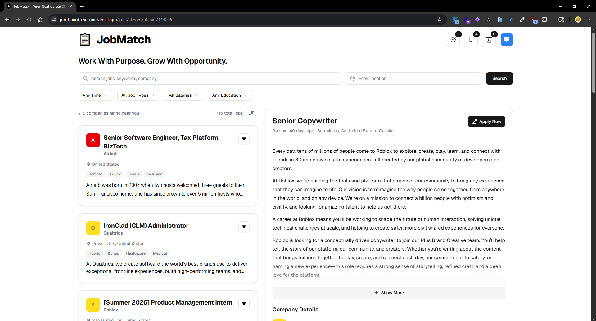
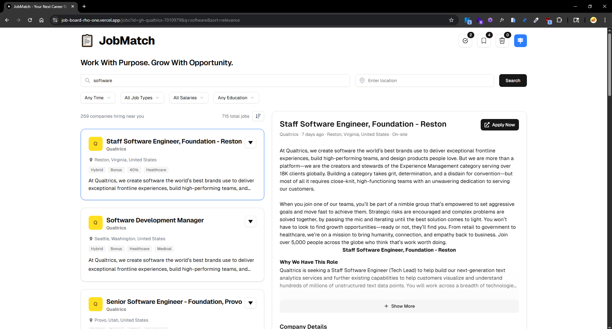

# JobMatch – Job Board Web App | Next.js, TypeScript, TailwindCSS

A fully-featured job board demonstrating advanced state management, polished UI/UX, and deployment to production.
Includes job search, filtering, pagination, and persistent save/dismiss functionality.

🌐 Live Demo: [job-board-rho-one.vercel.app/job](https://job-board-rho-one.vercel.app/job)

---

## ✨ Features

- 🔍 **Search, Filter & Sort** – quickly find jobs by keyword, location, or type
- ↩️ **URL & Back Navigation** – smooth browsing with preserved search state
- ⚡ **Error Handling & Loading States** – skeletons, spinners, and “No Results” messages for clean UX
- 📱 **Mobile Responsive** – optimized layouts for all screen sizes
- 📑 **Pagination** – handles large job sets gracefully
- 💾 **Job State Management** – save, dismiss, and track applied jobs (persistent)
- 🎨 **Modern UI** – styled with TailwindCSS + shadcn/ui

---

## 📸 Screenshots


_JobMatch home page with search and filters._


_Search results._

---

## 🛠️ Tech Stack

- **Framework:** Next.js (App Router)
- **Frontend:** React, TypeScript, TailwindCSS, shadcn/ui
- **State Management:** React hooks + localStorage persistence
- **Deployment:** Vercel (with custom domain)

---

## 🚀 Getting Started

Clone the repo and install dependencies:

```bash
git clone https://github.com/yourusername/jobmatch.git
cd jobmatch
npm install
npm run dev
```

---

## 📊 Data Source

Snapshot captured on 9/22/2025 from public Greenhouse pages. One-off script kept private to avoid ToS churn; happy to share on request.

---

## 📄 Status

Project complete & deployed — ongoing polish and feature experiments.

---

## 🔮 Future Ideas

- Real-time job scraping with APIs
- Authentication & user accounts
- Admin dashboard for job posting
